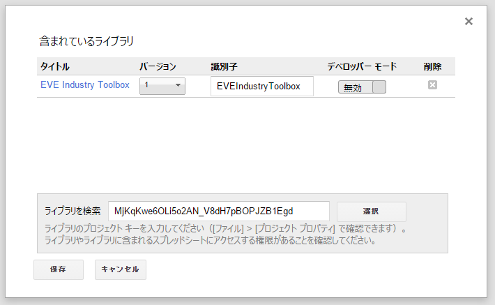

.. _how_to_import_library:

Googleスプレッドシート向け関数の利用方法
========================================

Googleスプレッドシート向け関数を利用するためには、関数ごとに以下の手順が必要です。

1. スクリプトエディタを開く

2. ライブラリを開く

.. image:: ../images/open_library.png

3. プロジェクトを適当な名前で保存する

4. 利用する関数のプロジェクトIDを「ライブラリを検索」テキストボックスへ入れる

   プロジェクトIDは各関数の説明ページに掲載しています。

5. 最新のバージョンを選択する

6. コードをコピペして保存する。コードの内容は各関数の説明ページに掲載しています。

   複数の関数を利用する際には、空行をはさんでつなげてください。
   例えば以下のようになります。::

     function getMarketPrice(a, b, c, d, e) {
       return EVEOnlineGetCRESTMarketPrice.getMarketPrice(a, b, c, d, e)
     }

     function getSystemCostIndex(a,b) {
       return EVESystemCostIndex.getSystemCostIndex(a,b)
     }

以上で準備完了です。
