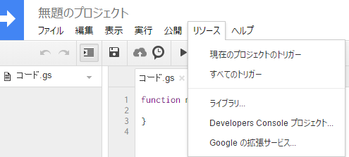

.. _industry_toolbox:

Industry Toolbox
================

Googleスプレッドシート向けのマーケット情報を取得する関数群です。

現在は以下の関数を提供しています。

.. toctree::
   :maxdepth: 1

   get_adjusted_price
   get_market_price
   get_system_cost_index
   get_trade_volume

インストール方法
----------------

1. スクリプトエディタを開く

.. image:: ../images/open_script_editor.png

2. ライブラリを開く

3. プロジェクトを適当な名前で保存する

.. image:: ../images/save_project.png

4. 以下のプロジェクトIDを「ライブラリを検索」テキストボックスへ入れる ::

     MjKqKwe6OLi5o2AN_V8dH7pBOPJZB1Egd

5. 最新のバージョンを選択する

.. image:: ../images/select_version.png

6. 以下のコードをコピペして保存する。 ::

     function getMarketPrice(region_id, type_id, station_string, sell_or_buy_string, min_or_max_string, refresh_code) {
       return EVEIndustryToolbox.getMarketPrice(region_id, type_id, station_string, sell_or_buy_string, min_or_max_string, refresh_code)
     }

     function getAdjustedPrice(type_id, refresh_code) {
       return EVEIndustryToolbox.getAdjustedPrice(type_id)
     }

     function getTradeVolume(region_id, type_id, operation_string, refresh_code) {
       return EVEIndustryToolbox.getTradeVolume(region_id, type_id, operation_string)
     }

     function getSystemCostIndex(system_name, activity_name, refresh_code) {
       return EVEIndustryToolbox.getSystemCostIndex(system_name, activity_name)
     }

     function onOpen() {
       EVEIndustryToolbox.onOpen()
     }

     function showRequestCount() {
       EVEIndustryToolbox.showRequestCount()
     }

以上で準備完了です。

更新履歴
--------
Ver.1 2016/02/12
     初出ということで。
